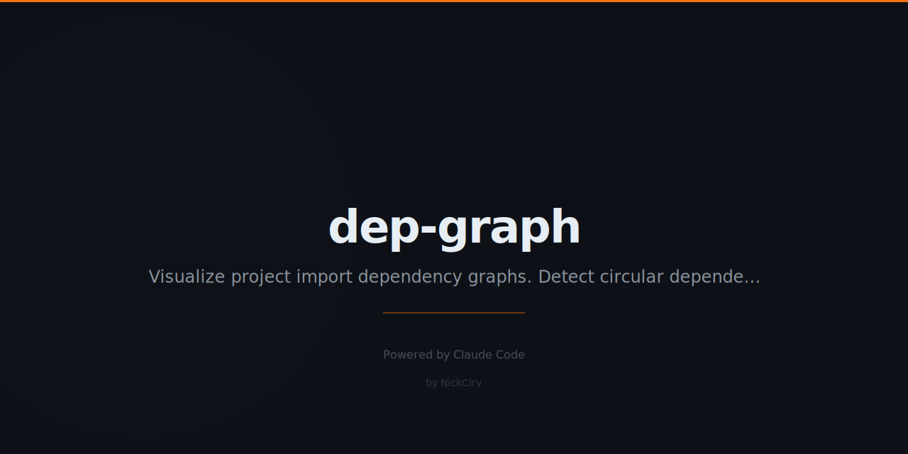

# dep-graph
> Visualize your project's import dependency graph. Find circular deps and orphaned files.

```bash
npx dep-graph
npx dep-graph --circular
```

```
dep-graph · 87 files · 312 edges
━━━━━━━━━━━━━━━━━━━━━━━━━━━━━━━━━━━━━━━

src/index.js
├── src/auth/handler.js
│   ├── src/db/client.js
│   └── src/utils/crypto.js
└── src/api/router.js
    └── src/db/client.js  (↑ shown)

⚠  Circular: src/a.js → src/b.js → src/a.js

Most depended upon:
  src/db/client.js   imported by 23 files
━━━━━━━━━━━━━━━━━━━━━━━━━━━━━━━━━━━━━━━
```

## Commands
| Command | Description |
|---------|-------------|
| `dep-graph` | Full dependency tree |
| `--circular` | Find circular dependencies |
| `--orphans` | Find orphaned files |
| `--depth N` | Limit tree depth |
| `--format dot\|json\|text` | Output format |

## Install
```bash
npx dep-graph
npm install -g dep-graph
```

---
**Zero dependencies** · **Node 18+** · Made by [NickCirv](https://github.com/NickCirv) · MIT
